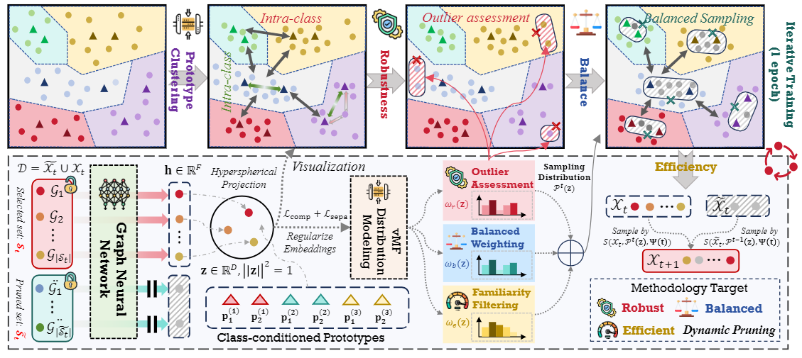
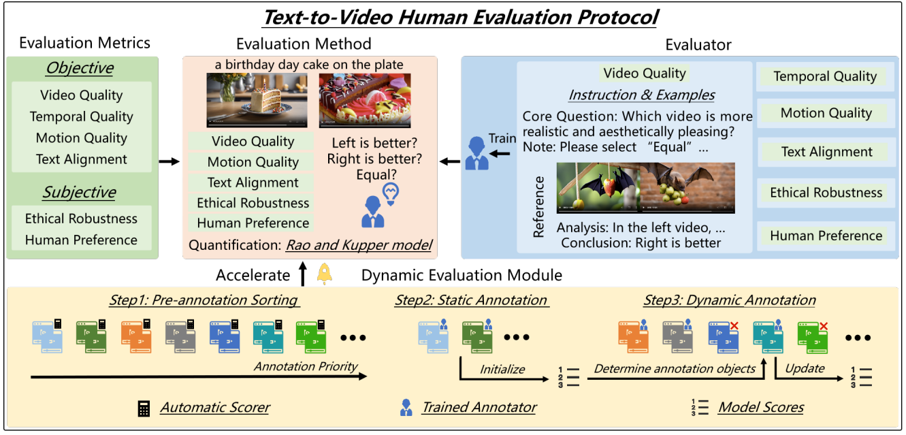








# About me

Hi there! 

I am a 4th-year undergraduate student at the University of Electronic Science and Technology of China (UESTC) and a research intern at Shanghai AI Lab. I was previously a research assistant at the National University of Singapore (NUS), supervised by Prof. [Yang You](https://www.comp.nus.edu.sg/~youy/). I also worked with Dr. [Kai Wang](https://kaiwang960112.github.io/), Prof. [Wei Jin](https://www.cs.emory.edu/~wjin30/) and Prof. [Yuxuan Liang](https://yuxuanliang.com/).

# News
- *2024.12*：I win **The Most Outstanding Students Award of UESTC** (The Highest Honor for UESTC students, **Top 10** among all 5500+ undergraduate students, 10k RMB)!
- *2024.10*：I win the the UESTC-Friendship Scholarship (10K RMB). I also win the first-class scholarship (2k RMB) for the third time.
- *2024.10*: I am selected as an Outstanding Graduate of UESTC and an Outstanding Graduate of Sichuan Province.
- *2024.09*: I am invited to serve as a reviewer for AISTATS 2025.
- *2024.09*: Two papers are accepted by NeurIPS 2024. Congrats to Guibin and Tianle!
- *2024.09*: I am invited to serve as a reviewer for ICASSP 2025.
- *2024.08*: I am invited to serve as a reviewer for ICLR 2025.
- *2024.07*: I am joining [Shanghai AI Laboratory](https://www.shlab.org.cn/) as a research intern.
- *2024.05*: I am invited to serve as a reviewer for NeurIPS 2024.
- *2024.05*: I am invited to serve as a reviewer for ACM MM 2024.
- *2024.05*: [GEOM](https://arxiv.org/abs/2402.05011), the first lossless graph condensation approach is accepted by ICML 2024!
- *2024.05*: Our workshop: [The First Dataset Distillation Challenge](https://www.dd-challenge.com/) got accepted at ECCV 2024 as a half-day workshop!
- *2023.10*: I win the UESTC-Friendship (HuaMeng) Scholarship (10k RMB). I also won the first-class scholarship (2k RMB) for the second time.
- *2023.09*: [DSN](https://proceedings.neurips.cc/paper_files/paper/2023/file/d7b3cef7c31b94a4a533db83d01a8882-Paper-Conference.pdf), the first approach achieved positive BWT, is accepted by NeurIPS 2023!

# Publications ([Full List](https://scholar.google.com/citations?user=Y2oqeP0AAAAJ&hl=zh-CN))

<dl>
<dt>
</dt>
<dd><a href="https://arxiv.org/abs/2402.05011">
<strong>Navigating Complexity: Toward Lossless Graph Condensation via Expanding Window Matching
</strong></a></dd>
<dd><strong><u>Yuchen Zhang</u></strong>, Tianle Zhang, Kai Wang, Ziyao Guo, Yuxuan Liang, Xavier Bresson, Wei Jin, Yang You</dd>
<dd><strong>International Conference on Machine Learning (ICML), 2024.</strong></dd>
</dl>
 
 
 

---

<dl>
<dt>
</dt>
<dd><a href="https://proceedings.neurips.cc/paper_files/paper/2023/file/d7b3cef7c31b94a4a533db83d01a8882-Paper-Conference.pdf">
<strong>Enhancing Knowledge Transfer for Task Incremental Learning with Data-free Subnetwork
</strong></a></dd>
<dd>Qiang Gao, Xiaojun Shan, <strong><u>Yuchen Zhang</u></strong>, Fan Zhou</dd>
<dd><strong> Advances in Neural Information Processing Systems (NeurIPS), 2023. </strong></dd>
</dl>
 
 
 

---

<dl>
<dt>
</dt>
<dd><a href="">
<strong>GDeR: Safeguarding Efficiency, Balancing, and Robustness via Prototypical Graph Pruning
</strong></a></dd>
<dd>Guibin Zhang, Haonan Dong, <strong><u>Yuchen Zhang</u></strong>, Zhixun Li, Dingshuo Chen, Kai Wang, Tianlong Chen, Yuxuan Liang, Dawei Cheng, Kun Wang</dd>
<dd><strong> Advances in Neural Information Processing Systems (NeurIPS), 2024. </strong></dd>
</dl>
 
 
 

---

<dl>
<dt>
</dt>
<dd><a href="https://arxiv.org/abs/2406.08845">
<strong>Rethinking Human Evaluation Protocol for Text-to-Video Models: Enhancing Reliability, Reproducibility, and Practicality
</strong></a></dd>
<dd>Tianle Zhang, Langtian Ma, Yuchen Yan, <strong><u>Yuchen Zhang</u></strong>, Kai Wang, Yue Yang, Ziyao Guo, Wenqi Shao, Yang You, Yu Qiao, Ping Luo, Kaipeng Zhang</dd>
<dd><strong> Advances in Neural Information Processing Systems (NeurIPS), 2024. </strong></dd>
</dl>

 
 
 
 
 

# Honors and Awards
- *2024-12* **The Most Outstanding Students Award of UESTC** (The Highest Honor for UESTC students)

- *2024-10* UESTC-Friendship Scholarship (10K RMB) 

- *2024-10* First-class Scholarship

- *2024-10* Outstanding Graduate of Sichuan Province

- *2024-10* Outstanding Graduate of UESTC

- *2024-05* Provincial Second Prize, 9th C4-Network Technology Challenge

- *2024-05* Provincial Second Prize, 17th China	Collegiate Computing Competition

- *2023-10* UESTC-Friendship (HuaMeng)	Scholarship (10k RMB)

- *2023-10* First-class Scholarship

- *2023-07* National Second Prize, 16th China	Collegiate Computing Competition

- *2023-06* Provincial First Prize, 16th China Collegiate Computing Competition

- *2023-06* Provincial Second Prize, 8th C4-Network Technology Challenge

- *2023-05* Provincial Second Prize, 13th China National Undergraduate "Innovation, Creativity and Entrepreneurship" Challenge

- *2022-10* First-class Scholarship 

- *2022-08* Best Project Award, 2022 NJU NLP SummerCamp

# Invited Talks
- *2024.05*, "Lossless Graph Condensation" on [Techbeat](https://www.techbeat.net/talk-info?id=873).

# Working Experiences
- *2024.10 - present*, Shanghai AI Lab, advised by Prof. [Yu Cheng](https://ych133.github.io/).
- *2023.06 - 2024.07*, HPC-AI Lab, NUS, advised by Prof. [Yang You](https://www.comp.nus.edu.sg/~youy/).
- *2022.10 - 2023.06*, ICDM Lab, UESTC, advised by Prof. [Fan Zhou](https://scholar.google.com/citations?user=Ihj2Rw8AAAAJ&hl=zh-CN).

# Academic Service
- Organizer of ECCV 2024 Workshop: [The First Dataset Distillation Challenge](https://www.dd-challenge.com/).
- Reviewer of WWW 2024, NeurIPS 2024, ACM MM 2024, ICLR 2025, ICASSP 2025, AISTATS 2025.
